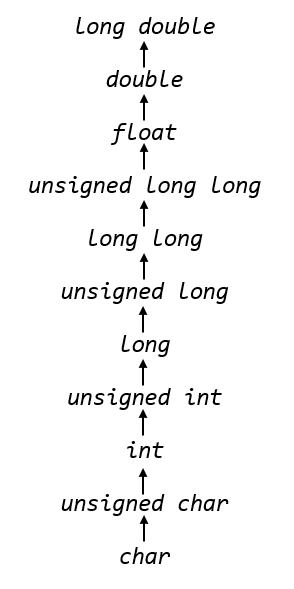

# type casting 

the type casting is a way to convert variables, constants or expression from one type to another type. conversion from one type to another is often required in programming.

C support two types of typecasting: 
 
 1. Implicit typecasting
 2. Explicit typecasting 

# Implicit typecasting 

Implicit typecasting is automatic type conversion done by the compiler. the compiler automatically handles data type conversion. it converts variables and constants of lower type to higher whenver required. here we will take about `Integer promotion rules` 

 - Integer promotion rules: 

 Compilers are smart at optimizing code for better performance. In the process of code optimization, the C compiler will perform integer promotion. the compiler automatically converts all operands to a common type (higher type used in expression). The process of converting a lower type to higher is known as integer promotion.

 


- Example: 

```c
#include <stdio.h>
int main()
{
    char c = 'A';
    int  nbr = c + 10; //here compiler will apply the integer promotion Rule

    printf("My value is : %d", nbr);
    return 0; 
}
```

Output : 

```
My value is : 75% 
```

- Note : 

 In Inplicit conversion may result in data or sign loss, for exampkle when we promoting `long long` to `unsigned long long ` The negative sign is lost. also while promoting `unsigned long long` to `float` you may lose data.


 # Explicit typecasting 

Explicit typecasting is manual type conversion form one type to another type. In explicit cast we have full control over the conversion. Explicit conversion can be proformed bi-directional . you can cast both a lower type to higher as well as a higher type to lower.

- Syntax : 


```c 
(new-type) 
```